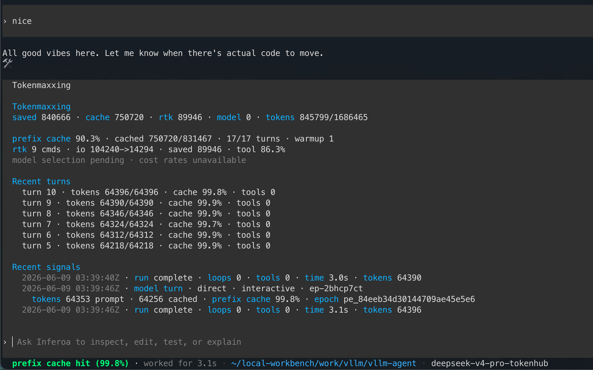

<p align="center">
  
</p>

<p align="center">
  <strong>Inference-native Tokenmaxxing Agent Harness</strong>
</p>

<p align="center">
  <a href="https://github.com/agentic-in/inferoa">GitHub</a>
  ·
  <a href="https://inferoa.agentic-in.ai/docs/intro">Docs</a>
  ·
  <a href="website/blog/2026-06-08-announcing-inferoa.md">Blog</a>
</p>

Most agents call models as if inference were a **black box**. The agent loop,
router, serving engine, context system, and multimodal path are usually split
apart, so the agent cannot tokenmaxx across the optimization rules that modern
inference systems make possible.

> Prefix cache stability is ignored. Routing is
bolted on later. Context is pasted until it fits. Users pay for that gap.

Inferoa is an **Inference-native Tokenmaxxing Agent Harness** for long-horizon
tasks. It starts from the inference stack and designs the agent loop around
tokenmaxxing: Prefix-cache discipline, Context Optimization with CodeGraph and
RTK, Intelligent routing, Self-Hosted Model Serving through vLLM Engine and
vLLM Omni, and verification all belong to the same durable session.

## TUI Preview

<div align="center">
  <table>
    <tr>
      <th>Welcome</th>
      <th>Tokenmaxxing</th>
    </tr>
    <tr>
      <td align="center"></td>
      <td align="center"></td>
    </tr>
    <tr>
      <th>Prefix Cache Status</th>
      <th>Goal Mode</th>
    </tr>
    <tr>
      <td align="center"></td>
      <td align="center"></td>
    </tr>
    <tr>
      <th>Plan Mode</th>
      <th>Autoresearch Mode</th>
    </tr>
    <tr>
      <td align="center"></td>
      <td align="center"></td>
    </tr>
  </table>
</div>

## Why Tokenmaxxing

Long-horizon agents are not one prompt. They are many turns of planning,
editing, tool use, retries, compaction, cache warmup, route selection, and
verification. If the harness treats every turn as generic chat traffic, it
throws away the optimization surface underneath it.

inferoa makes those tokenmaxxing surfaces first-class:

- **Prefix cache is protected**, not merely reported after the turn.
- **Goals, plans, and autoresearch** are native long-horizon modes.
- **Context is optimized with CodeGraph and RTK**, not pasted until the window
  is full.
- **Intelligent routing chooses the model path** by cost, safety, privacy,
  capability, and session pressure.
- **Self-hosted model serving shapes the next turn**: vLLM Engine latency,
  usage, cache behavior, endpoint capability, and vLLM Omni multimodal paths
  are visible to the harness.

## Tokenmaxxing Across The Inference Stack

inferoa is built on top of the vLLM ecosystem and extends tokenmaxxing across
the inference stack:

| Surface | Substrate | inferoa role | Tokenmaxxing target |
| --- | --- | --- | --- |
| Agent Harness | [inferoa](https://github.com/agentic-in/inferoa) | Goals, plans, autoresearch, sessions, tools, recovery, verification | Avoid restart, redo, and lost-state cost |
| Prefix-cache discipline | vLLM-compatible serving | Stable prompt epochs, deterministic tool schemas, bounded context sections, cache reports | Reuse the expensive prompt prefix |
| Context Optimization | [CodeGraph](https://www.npmjs.com/package/@colbymchenry/codegraph), [RTK](https://github.com/rtk-ai/rtk) | Select repo evidence, symbols, summaries, resources, and compressed command output | Spend fewer prompt and tool-output tokens |
| Intelligent routing | [vLLM Semantic Router](https://github.com/vllm-project/semantic-router) | Choose model paths by cost, safety, privacy, capability, and session pressure | Avoid one expensive path for every turn |
| Self-Hosted Model Serving | [vLLM Engine](https://github.com/vllm-project/vllm), [vLLM Omni](https://github.com/vllm-project/vllm-omni) | Use direct OpenAI-compatible serving, endpoint signals, and multimodal paths | Keep cache, cost, latency, and data-control surfaces native |

## Core Design

- **Long-horizon modes**: goal, plan, and autoresearch are native workflows,
  not prompt templates.
- **Prefix-cache discipline**: stable prompt epochs, deterministic tool schemas,
  bounded context sections, and cache reports protect reusable prefixes.
- **Context optimization**: [CodeGraph](https://www.npmjs.com/package/@colbymchenry/codegraph),
  [RTK](https://github.com/rtk-ai/rtk), and built-in coding harnesses reduce
  token consumption while preserving the evidence the model needs.
- **Intelligent routing**: model paths can respond to cost, safety, privacy,
  capability, and session pressure.
- **Self-hosted model serving**: vLLM Engine and vLLM Omni keep usage, cache,
  model, endpoint, request, and multimodal signals close enough to influence
  the next agent action.

## Core Commands

- `/goal` keeps a durable objective, decomposition, evidence, and completion
  audit across long-running work.
- `/plan` turns ambiguous scope into an inspectable plan that can be revised
  before execution.
- `/autoresearch` runs benchmark-style iteration with metrics and failure
  evidence in the same session.
- `/tokenmaxxing` shows token and cost pressure in one place: prefix-cache
  reuse, CodeGraph/RTK context savings, recent turn usage, and model-selection
  cost pressure.

## Installation

```bash
npm install -g inferoa
inferoa setup
inferoa
```

For one-shot print mode:

```bash
inferoa --print "Inspect this repository and summarize the test entrypoints."
```

inferoa stores local state under `~/.inferoa/`. Model endpoint credentials are
stored through the local vault; config files keep references rather than raw
secrets.

## Acknowledgements

inferoa is built for and with the vLLM ecosystem:

- [vLLM Engine](https://github.com/vllm-project/vllm)
- [vLLM Semantic Router](https://github.com/vllm-project/semantic-router)
- [vLLM Omni](https://github.com/vllm-project/vllm-omni)
