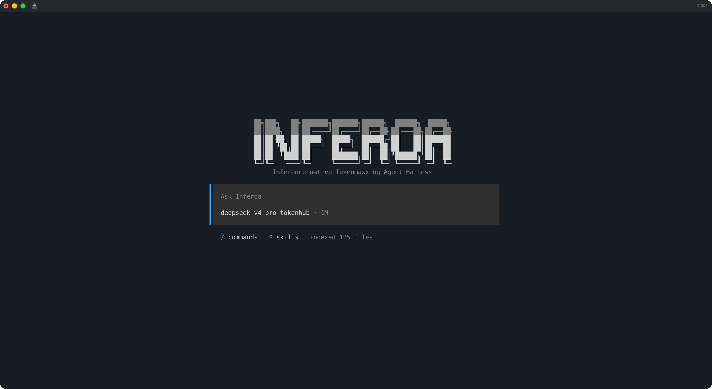
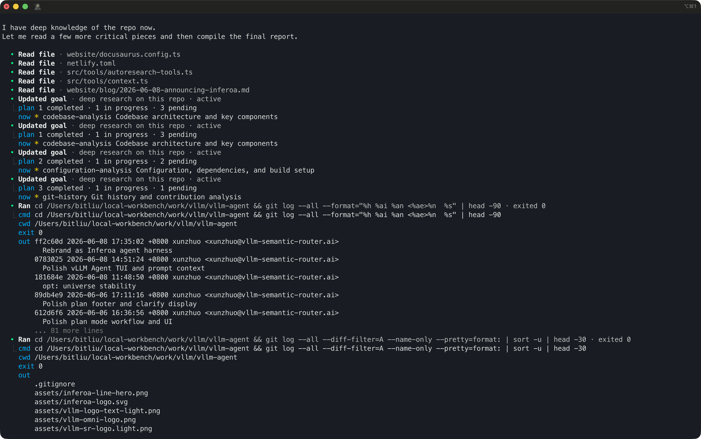
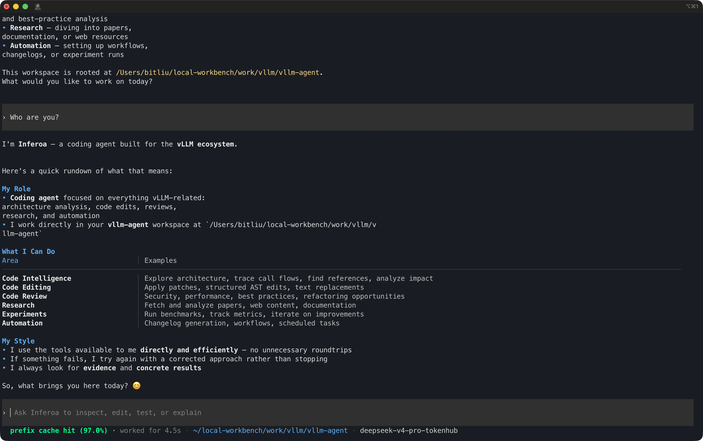
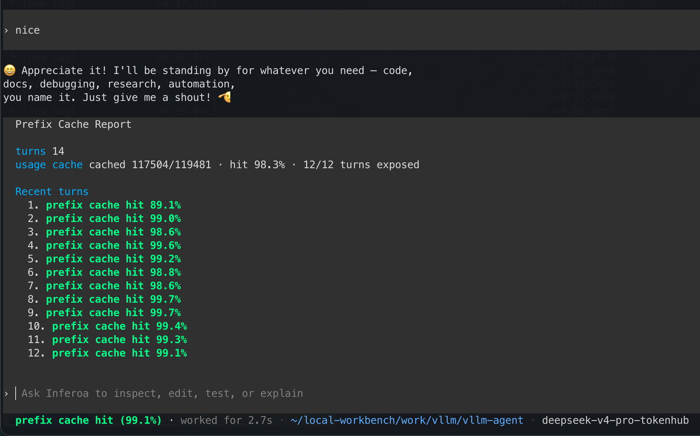
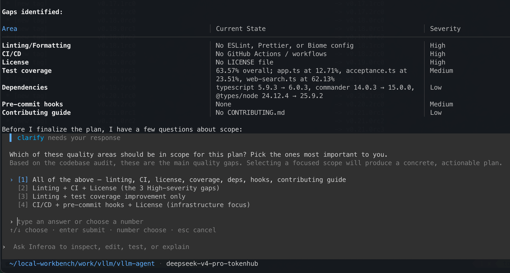
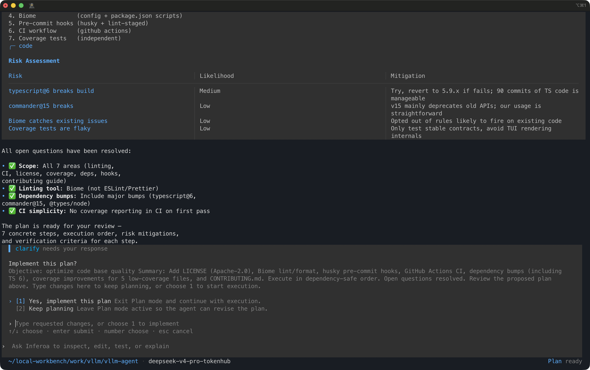
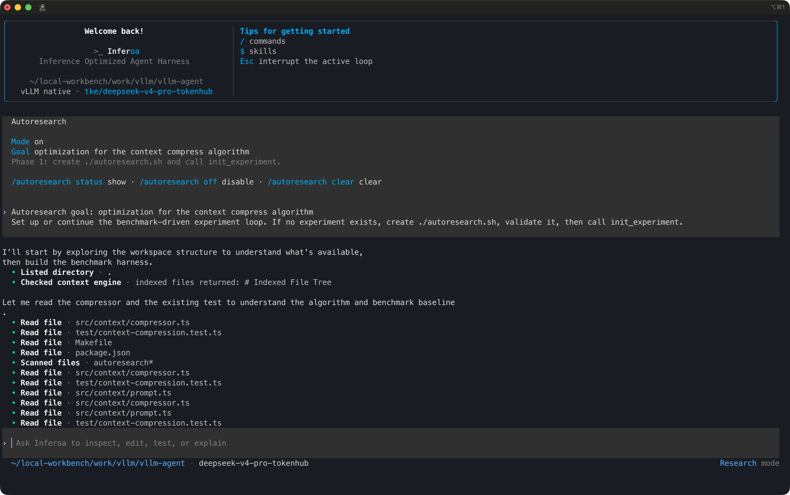
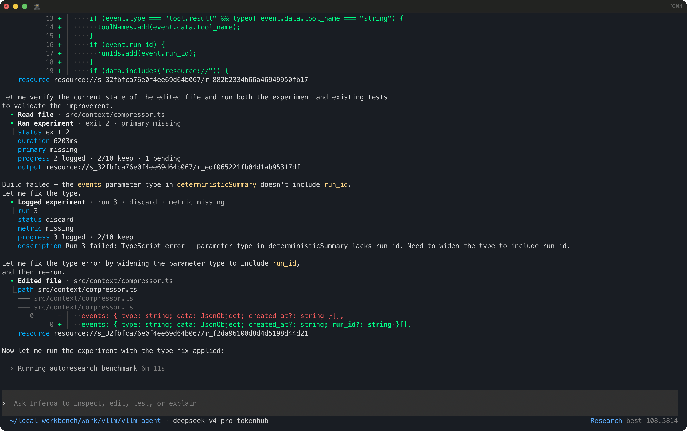

<p align="center">
  
</p>

<p align="center">
  <strong>The Inference Optimized Agent Harness</strong>
</p>

<p align="center">
  <a href="https://github.com/agentic-in/inferoa">GitHub</a>
  ·
  <a href="https://inferoa.agentic-in.ai/docs/intro">Docs</a>
  ·
  <a href="website/blog/2026-06-08-announcing-inferoa.md">Blog</a>
</p>

Most agents call models as if inference were a **black box**. The agent loop,
router, serving engine, context system, and multimodal path are usually split
apart, so the agent does not follow the optimization rules that modern
inference systems make possible.

> Prefix cache stability is ignored. Routing is
bolted on later. Context is pasted until it fits. Users pay for that gap.

Inferoa is an **Inference Optimized Agent Harness** for long-horizon tasks. It
starts from the inference stack and designs the agent loop around it: goals,
plans, autoresearch, context optimization, intelligent routing, serving
signals, prefix-cache protection, multimodal capability, and verification all
belong to the same durable session.

## TUI Preview

<div align="center">
  <table>
    <tr>
      <th>Welcome</th>
      <th>Goal Mode</th>
    </tr>
    <tr>
      <td align="center"></td>
      <td align="center"></td>
    </tr>
    <tr>
      <th>Prefix Cache Status</th>
      <th>Prefix Cache Report</th>
    </tr>
    <tr>
      <td align="center"></td>
      <td align="center"></td>
    </tr>
    <tr>
      <th>Plan Scope</th>
      <th>Plan Approval</th>
    </tr>
    <tr>
      <td align="center"></td>
      <td align="center"></td>
    </tr>
    <tr>
      <th>Autoresearch Setup</th>
      <th>Autoresearch Iteration</th>
    </tr>
    <tr>
      <td align="center"></td>
      <td align="center"></td>
    </tr>
  </table>
</div>

## Why Inferoa

Long-horizon agents are not one prompt. They are many turns of planning,
editing, tool use, retries, compaction, cache warmup, route selection, and
verification. If the harness treats every turn as generic chat traffic, it
throws away the optimization surface underneath it.

Inferoa makes those surfaces first-class:

- **Prefix cache is protected**, not merely reported after the turn.
- **Goals, plans, and autoresearch** are native long-horizon modes.
- **Context is selected as evidence**, not pasted until the window is full.
- **Intelligent routing chooses the model path** by cost, safety, privacy,
  capability, and session pressure.
- **Serving signals shape the next turn**: latency, usage, cache behavior, and
  endpoint capability are visible to the harness.
- **Multimodal work stays durable** with the same session, tools, files, and
  verification loop.

## Optimized with Inference Stack

Inferoa is built on top of the vLLM Ecosystem and extends across the inference
stack:

| Layer | Substrate | Inferoa role | Optimization target |
| --- | --- | --- | --- |
| Agent Harness | [Inferoa](https://github.com/agentic-in/inferoa) | Goals, plans, autoresearch, sessions, tools, recovery, verification | Keep long-horizon work coherent and resumable |
| Context Optimization | [CodeGraph](https://www.npmjs.com/package/@colbymchenry/codegraph), [RTK](https://github.com/rtk-ai/rtk)... | Select repo evidence, symbols, summaries, resources, and tool results | Spend fewer tokens and improve coding accuracy |
| Intelligent Routing | [vLLM Semantic Router](https://github.com/vllm-project/semantic-router) | Choose model paths by cost, safety, privacy, capability, and session pressure | Avoid using one expensive path for every turn |
| Serving | [vLLM Engine](https://github.com/vllm-project/vllm) | Use high-performance OpenAI-compatible inference and endpoint signals | Protect prefix cache stability across the session |
| Multimodal | [vLLM Omni](https://github.com/vllm-project/vllm-omni) | Bring image, video, and audio understanding/generation into the same loop | Keep multimodal tasks durable and inspectable |

## Core Design

- **Long-horizon modes**: goal, plan, and autoresearch are native workflows,
  not prompt templates.
- **Prefix-cache discipline**: stable prompt epochs, deterministic tool schemas,
  bounded context sections, and cache reports protect reusable prefixes.
- **Context optimization**: [CodeGraph](https://www.npmjs.com/package/@colbymchenry/codegraph),
  [RTK](https://github.com/rtk-ai/rtk), and built-in coding harnesses reduce
  token consumption while preserving the evidence the model needs.
- **Intelligent routing**: model paths can respond to cost, safety, privacy,
  capability, and session pressure.
- **Serving feedback**: usage, cache, model, endpoint, and request signals are
  visible enough to influence the next agent action.
- **Durable multimodal loop**: image, video, and audio generation or
  understanding are part of the same session history and artifact model.

## Installation

```bash
npm install -g inferoa
inferoa setup
inferoa
```

For one-shot print mode:

```bash
inferoa --print "Inspect this repository and summarize the test entrypoints."
```

Inferoa stores local state under `~/.inferoa/`. Model endpoint credentials are
stored through the local vault; config files keep references rather than raw
secrets.

## Acknowledgements

Inferoa is built for and with the vLLM ecosystem:

- [vLLM Engine](https://github.com/vllm-project/vllm)
- [vLLM Semantic Router](https://github.com/vllm-project/semantic-router)
- [vLLM Omni](https://github.com/vllm-project/vllm-omni)
