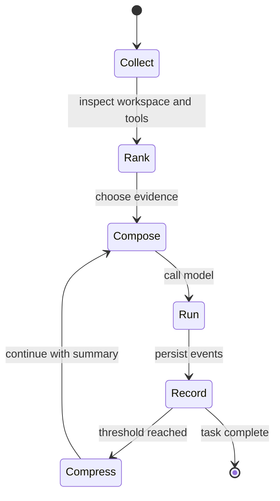

Context optimization decides what the next model call actually needs. Inferoa
uses a layered approach: recent dialogue stays protected, older context can be
compressed, repository evidence is selected, and large tool outputs are folded
or stored as resources.

## Lifecycle



## Defaults

Inferoa ships with these defaults in `src/config/defaults.ts`:

- `context.compression_threshold: 0.8`
- `context.context_window: 32768`
- `context.protected_recent_loops: 3`
- `context.engine.provider: auto`
- `context.engine.startup: welcome`
- `context.engine.require_ready_before_chat: true`
- `context.engine.watch: true`

These settings keep recent tool loops visible while allowing older material to
move into summaries or managed resources.

## Code Intelligence

When available, the context engine uses repository structure and symbols to
avoid broad file reads. It can combine built-in search with
[CodeGraph](https://www.npmjs.com/package/@colbymchenry/codegraph) and
[RTK](https://github.com/rtk-ai/rtk) so the agent retrieves targeted evidence
rather than repeatedly dumping large files into the prompt. Set
`context.engine.provider` to `auto`, `codegraph`, `builtin`, or `off`.

## Manual Controls

Use:

```text
/context                     Show context and code intelligence state
/context reindex             Rebuild the context index
/tools                       Show fixed tool schemas
/tools expand                Expand the latest folded tool run
/tools compact               Fold long successful tool runs
```

`/context` shows usage and compression state. `/context reindex` rebuilds the
context index after large workspace changes. `/tools compact` folds long
successful tool traces, while `/tools expand` opens the latest folded trace
when you need detail.
