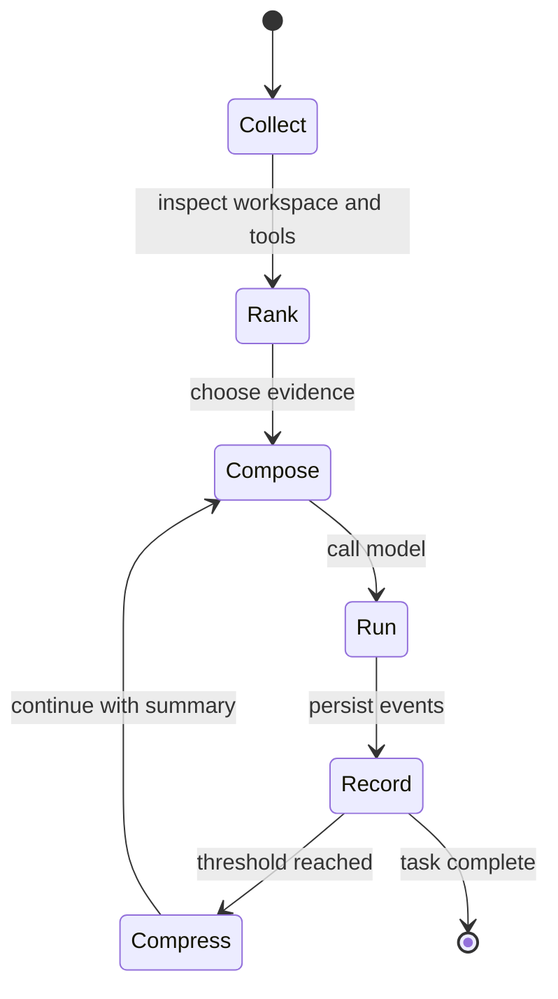

Context optimization decides what the next model call actually needs. Inferoa
uses a layered approach: recent dialogue stays protected, older context can be
compressed, repository evidence is selected, and large tool outputs are folded
or stored as resources.

## Lifecycle



## Defaults

Inferoa ships with these defaults in `src/config/defaults.ts`:

- `context.compression_threshold: 0.75`
- `context.context_window: 256000`
- `context.auto_compact_failure_limit: 3`
- `context.compact_recent_file_limit: 5`
- `context.compact_recent_file_token_limit: 5000`
- `context.compact_recent_total_token_limit: 25000`
- `context.protected_recent_loops: 3`
- `context.engine.provider: auto`
- `context.engine.startup: welcome`
- `context.engine.require_ready_before_chat: true`
- `context.engine.watch: true`

These settings keep recent tool loops visible while allowing older material to
move into summaries or managed resources. Automatic compaction normally uses
headroom rather than a raw ratio: Inferoa reserves output tokens, keeps a compact
buffer, then compacts at `effective_window - compact_buffer`. Optional
`output_reserve_tokens` and `compact_buffer_tokens` can override the derived
values. Setting `compression_threshold` away from the default explicitly uses the
ratio trigger instead.

The compact request first tries a prefix-preserving request so providers that
support prefix caching can reuse the existing session prefix. If that request is
too large, Inferoa retries with a standalone payload and then a trimmed
standalone payload. If model summarization repeatedly fails, automatic compact
pauses after the configured failure limit while manual `/compact` remains
available.

## Code Intelligence

When available, the context engine uses repository structure and symbols to
avoid broad file reads. It can combine built-in search with
[CodeGraph](https://www.npmjs.com/package/@colbymchenry/codegraph) and
[RTK](https://github.com/rtk-ai/rtk) so the agent retrieves targeted evidence
rather than repeatedly dumping large files into the prompt. Set
`context.engine.provider` to `auto`, `codegraph`, `builtin`, or `off`.

## Manual Controls

Use:

```text
/context                     Show context and code intelligence state
/context reindex             Rebuild the context index
/compact [instructions]      Compact conversation history now
/tools                       Show fixed tool schemas
/tools expand                Expand the latest folded tool run
/tools compact               Fold long successful tool runs
```

`/context` shows usage and compression state. `/context reindex` rebuilds the
context index after large workspace changes. `/compact` forces a context
summary immediately and can take extra summary instructions. The post-compact
epoch also carries bounded continuity attachments for the latest read
files/resources, the active plan, and invoked skills. `/tools compact`
only folds long successful tool traces in the TUI, while `/tools expand` opens
the latest folded trace when you need detail.
