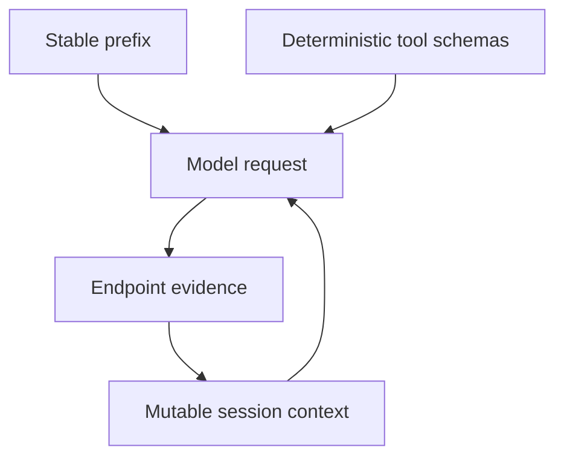

Prefix-cache discipline keeps stable prompt material stable across turns. The
goal is to let compatible serving engines reuse as much prompt work as possible
without hiding the evidence needed for accurate agent behavior.

## Prompt Epochs

Inferoa records prompt epochs with:

- provider id;
- model id;
- cache salt;
- prompt layout hash;
- tool schema hash;
- section hashes.

An epoch changes when the stable prompt layout changes. Ordinary task progress
should mostly alter bounded mutable sections, not the stable prefix.



## Endpoint Evidence

When the provider exposes usage fields, Inferoa records prompt tokens, cached
prompt tokens, request ids, response ids, model id, and headers that help
diagnose routing or cache behavior.

Not every provider reports cache details. In those cases, Inferoa omits cache
hit fields rather than fabricating a number.

## What Changes The Epoch

The prompt epoch changes — and the reusable prefix is invalidated — when any of
the following change:

- the provider or model id;
- the cache salt;
- the stable prompt layout (system prompt sections, section ordering);
- the tool schema hash (tool names, parameter shapes, or ordering).

Ordinary task progress — user messages, tool results, compressed summaries —
should only alter the bounded mutable section, not the stable prefix.

## Practical Guidance

- **Keep system prompt sections stable.** Avoid appending ad-hoc instructions
  to the system prompt mid-session. If you need a one-off instruction, send it
  as a user message instead.
- **Avoid unnecessary tool schema churn.** Adding or removing tools mid-session
  changes the tool schema hash and invalidates the prefix. Prefer configuring
  the full tool set at session start.
- **Use `/tokenmaxxing` to inspect cache behavior.** When the endpoint reports
  cache fields, the tokenmaxxing view shows cached prompt tokens alongside
  total prompt tokens so you can see whether the prefix is being reused.

## Reading Cache Evidence

When the endpoint returns usage detail, a typical cache-aware response includes:

```text
prompt_tokens: 12480
cached_prompt_tokens: 11200
completion_tokens: 340
```

In this example, roughly 90% of the prompt was served from cache — the stable
prefix is being reused effectively. If `cached_prompt_tokens` stays near zero
across turns, the epoch may be changing too often. Check whether system prompt
sections or tool schemas are being modified between turns.

## When Cache Details Are Unavailable

Not every provider reports cache fields. When cache detail is missing, Inferoa
omits cache hit fields rather than fabricating a number. You can still infer
prefix stability by watching whether the prompt token count stays consistent
across turns — a stable count with growing conversation length suggests the
mutable section is being managed without disturbing the prefix.
