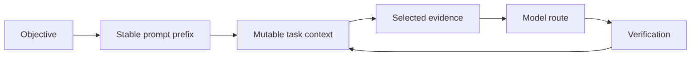

Tokenmaxxing is Inferoa's discipline for spending inference tokens where they
change the outcome. It is not only compression. It combines prompt stability,
context selection, routing, endpoint evidence, and verification.



## Surfaces

| Surface | What Inferoa Tracks | Why It Matters |
| --- | --- | --- |
| Prompt prefix | Prompt epochs, section hashes, tool schema hash | Avoid invalidating reusable prefixes |
| Context | Thresholds, protected recent loops, summaries | Keep the next turn focused |
| Tools | Deterministic schemas and bounded outputs | Reduce schema churn and output bloat |
| Endpoint | Provider, model, usage, request ids, cache fields | Make inference behavior inspectable |
| Artifacts | Managed resources for generated media and evidence | Avoid pasting large payloads into prompts |

## Reading Token Pressure

Open the tokenmaxxing view from the TUI:

```text
/tokenmaxxing
/tokenmaxxing trend
/tokenmaxxing signals
```

The view reports recent token usage, cache evidence when the endpoint exposes
it, RTK savings, context pressure, and model-selection pressure. Cache fields
are shown only when the provider returns enough usage detail to make them
meaningful. Compact boundaries show the reason, observed token deltas, archived
events, and message count changes. Compact model-call rows show cache read for
the summary request itself. Automatic compact failures, breaker pauses, skipped
auto-compacts, and manual compacts appear as lifecycle signals. Use
`/tokenmaxxing trend` for pageable metric panels with sparkline trends across
cache, prefix, context, RTK, and compact events. Use `/tokenmaxxing signals` for
raw lifecycle and evidence rows.
See [Slash commands](../reference/slash-commands.md) for the full registry.

## Interpreting The View

The tokenmaxxing view groups signals into four areas:

| Area | What It Shows | What To Watch For |
| --- | --- | --- |
| Token usage | Recent prompt and completion tokens per turn | Sudden spikes may mean context is not being compressed or a large file was read without bounding |
| Cache evidence | Cached prompt tokens, cache-gap calculations, and per-turn `new/safe/break/?` markers | `safe` means the previous request remains an exact prefix of the current request in the same epoch; `break` means the pre-turn context changed; `new` marks a new prompt epoch |
| RTK savings | Tokens saved by RTK context optimization | Zero savings may mean RTK is disabled or the workspace has not been indexed |
| Model selection | Which model handled recent turns | Unexpected model switches may indicate routing pressure or endpoint fallback |

## Practical Examples

**Stable prefix, good cache reuse:**

```text
prompt_tokens: 12480    cached: 11200    completion: 340
prompt_tokens: 12520    cached: 11200    completion: 280
prompt_tokens: 12610    cached: 11200    completion: 410
```

The cached token count stays constant while prompt tokens grow slowly — the
mutable section is absorbing task progress without disturbing the prefix.

**Prefix invalidation between turns:**

```text
prompt_tokens: 12480    cached: 11200    completion: 340
prompt_tokens: 12520    cached: 0        completion: 280
prompt_tokens: 12610    cached: 0        completion: 410
```

Cache drops to zero after the first turn. This usually means the tool schema
or a system prompt section changed between turns. Check whether tools were
added or removed mid-session.

## Relationship To Other Concepts

Tokenmaxxing depends on [Prefix cache](./prefix-cache.md) discipline to keep
the stable prefix reusable, and on [Context optimization](./context-optimization.md)
to reduce the mutable section. Together, these three disciplines control how
much inference work each turn actually costs.
