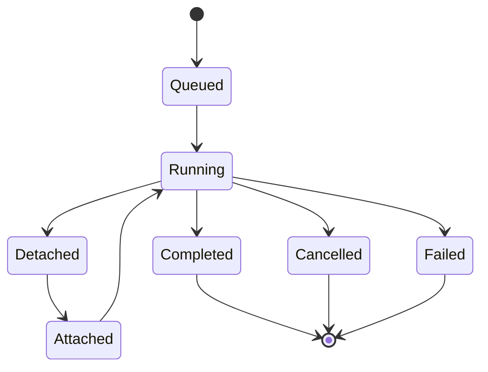

The daemon path runs supervised work outside the foreground TUI. It is useful
for long-running tasks that should survive terminal detach and later reattach.
The TUI commands own normal work; the debug CLI exists for automation, CI, and
acceptance runs.

## TUI Commands

Open the jobs view and manage supervised runs from the TUI:

```text
/jobs status                  Show daemon and job state
/jobs queue                   Queue a supervised run
/jobs attach                  Attach to a supervised run
/jobs detach                  Detach a supervised run
/jobs cancel                  Cancel a supervised run
```

The TUI shows queued, running, detached, cancelled, failed, and complete
states for each job. Long-running processes can keep the run alive after the
foreground terminal detaches; reattaching resumes the same session and event
log.

## Debug Commands

The debug CLI exposes the same lifecycle for automation and acceptance
validation. The full debug surface is listed in the
[CLI reference](../reference/cli.md).

```bash
inferoa debug daemon start [--foreground]   # Start the daemon
inferoa debug daemon status                  # Daemon process status
inferoa debug daemon jobs                    # List known jobs
inferoa debug daemon run <prompt>            # Queue a prompt and start the daemon
inferoa debug daemon goal <session>          # Run the goal supervisor on a session
inferoa debug daemon attach <job>            # Attach to a job
inferoa debug daemon detach <job>            # Detach a job
inferoa debug daemon cancel <job>            # Cancel a job
```

Use `inferoa --help` for the current command surface; subcommands may grow
between releases.

## Job Lifecycle



The session event log stores job state changes so a later TUI can inspect
what happened while the terminal was detached. The same event log is
replayed when an attached run resumes after a network blip or a machine
sleep.
