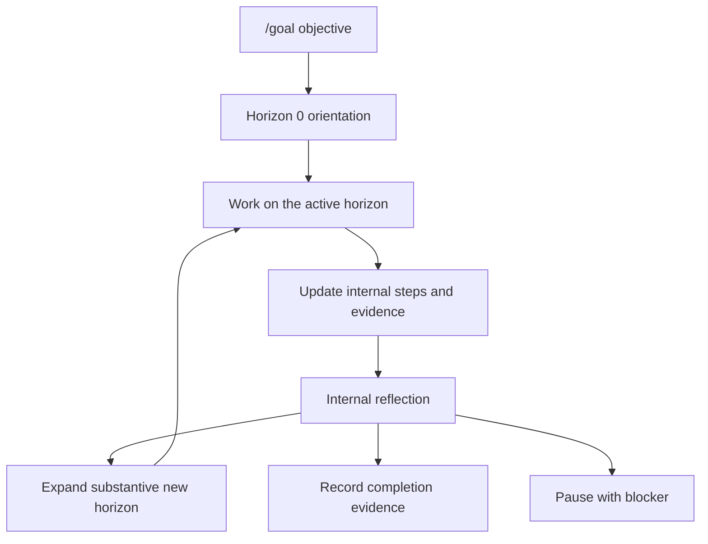

Goal mode is Inferoa's loop-engineering surface for recursive long-horizon
work. Run `/goal` to define the outcome once; Inferoa keeps inspecting,
changing, testing, reflecting, and continuing until the work is proven.

Use it when a task may span multiple turns, context compaction, tool failures,
verification passes, or a later resumed session.

## When To Use It

Use goal mode when the desired outcome is clear but the work is long:

- the agent needs to keep working until an objective is complete;
- progress needs an internal checklist, evidence, and status;
- completion should not depend on a single assistant turn;
- you want the session to preserve the objective across interruptions.

Do not use goal mode as a substitute for planning ambiguous scope. If the task
needs approval before edits begin, start with [Plan mode](./plan-mode.md).

## Basic Commands

```text
/goal Improve the docs site and verify the Docusaurus build.
/goal mode auto Improve the docs site and verify the Docusaurus build.
/goal mode focus Fix the failing parser test and verify it.
/goal mode explore Improve this package and handle related high-value issues.
/goal mode timebox 2h Audit this repository and improve the highest-value rough edges.
/goal mode research Reduce benchmark latency without hurting accuracy.
/goal mode research explore Find and validate latency improvement hypotheses.
/goal show
/goal complete
/goal pause
/goal resume
/goal drop
```

## Type And Approach

Bare `/goal <objective>` starts a task goal with automatic approach selection.
Inferoa first runs Horizon 0 orientation, then decides how broadly to pursue
the objective.

Goal type:

- `task` is the default for ordinary implementation, investigation, and
  verification work.
- `research` is for metric-driven experimental goals that need benchmark
  harnesses, hypotheses, runs, and metric evidence.

Approach:

- `auto` lets Inferoa choose after orientation.
- `focus` keeps the work scoped to the current objective.
- `explore` allows related high-value directions.
- `timebox` keeps working until a time checkpoint, then reflects.

Use `/goal` with no arguments to open the creation flow. If no goal is active,
Inferoa asks for the objective, then the goal type, then the approach.

## How It Works



The active goal stores:

- the original objective;
- the goal type (`task` or `research`);
- an internal goal plan and step status;
- the current horizon, starting with visible Horizon 0 orientation;
- an inferred or selected approach (`auto`, `focus`, `explore`, or `timebox`);
- a candidate ledger of open, completed, and rejected work;
- notes and structured evidence;
- token, tool, and time usage;
- the latest internal reflection decision.

The agent should keep step status and evidence current while working. An empty
checklist is not enough to finish the goal.

## Reflection And Completion

When the current horizon appears exhausted, Inferoa runs an internal
reflection. Reflection steps back from the current plan and asks whether more
work is needed to satisfy the original objective.

Reflection has a hard stop condition: it only expands the horizon when the new
work has substantive impact on the original objective. Otherwise it records
`decision=done` with verification evidence. If completion cannot proceed without
user input or an external state change, it records `decision=blocked`.

For broad goals, completion is also gated by the candidate ledger. If a
reflection says `done` while high-value candidates remain open, Inferoa expands
the next horizon instead of silently finishing.

Goal completion is gated by reflection. A visible `/goal complete` cannot bypass
unfinished internal steps or the latest reflection requirement. A goal is not
done because the checklist is empty; it is done after reflection records
evidence-backed completion.

## Research Goals

Research goals reuse the same goal supervisor loop, but each horizon is shown as
a research cycle. A research cycle can create, continue, complete, or reject
multiple experiments. Each experiment represents one hypothesis or solution
line, and each run records benchmark output and parsed `METRIC name=value`
evidence.

Research completion requires logged metric evidence. The goal cannot complete
while a benchmark run is pending, and a `done` reflection should cite run
history, the best observed metric, and guardrail or regression evidence.

## Relationship To Other Modes

Use [Plan mode](./plan-mode.md) before goal mode when the scope needs approval.
