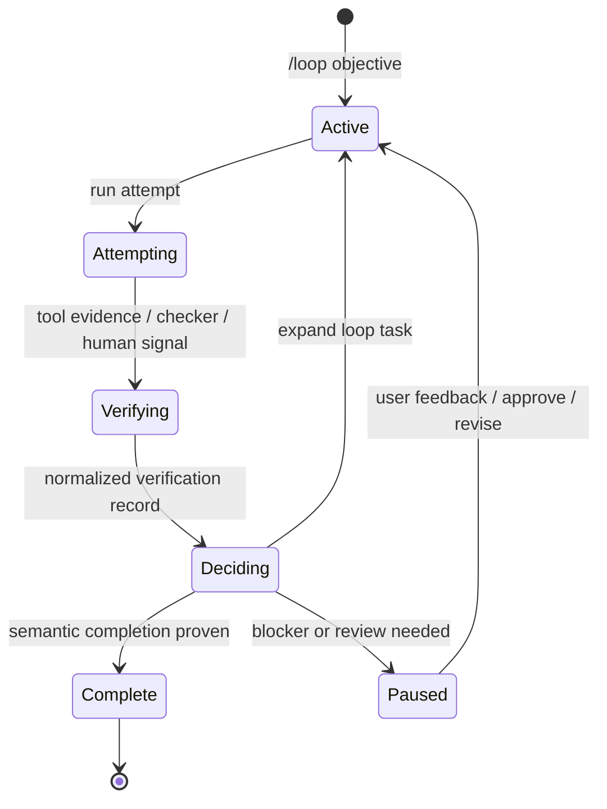

Loop mode is Inferoa's loop-engineering surface for recursive long-horizon
work. Run `/loop` to define the outcome once; Inferoa keeps inspecting,
changing, testing, verifying, deciding, and continuing until the work is proven.

Use it when a task may span multiple turns, context compaction, tool failures,
verification passes, or a later resumed session.

## When To Use It

Use loop mode when the desired outcome is clear but the work is long:

- the agent needs to keep working until an objective is complete;
- progress needs an internal checklist, evidence, and status;
- completion should not depend on a single assistant turn;
- you want the session to preserve the objective across interruptions.

Do not use loop mode as a substitute for planning ambiguous scope. If the task
needs approval before edits begin, start with [Plan mode](./plan-mode.md).

## Intelligent Model Selection

With `INFEROA_MODE=auto` and [vLLM Semantic Router](https://github.com/vllm-project/semantic-router), each loop turn can route to a different model. The TUI shows `selected: <model> / <decision>`.


See [Model endpoints](../configuration/model-endpoints.md) for setup.

## Basic Commands

```text
/loop Improve the docs site and verify the Docusaurus build.
/loop run deliver Improve the docs site and verify the Docusaurus build.
/loop run deliver --at-least 24h Improve this package and handle related high-value issues.
/loop run discover Reduce benchmark latency without hurting accuracy.
/loop run replay --count 100 say hi to me
/loop status
/loop pause
/loop resume
/loop drop
```

`/loop status` displays the active loop, current loop task, attempts, verification,
skills, pending review state, and latest loop decisions.

## Preference And Runtime

Bare `/loop <objective>` starts the creation flow. Inferoa asks for the
objective, a preference, runtime, and optional human-in-the-loop review.

Preference:

- `Deliver` closes an end-to-end objective with planning, execution,
  verification, and decision passes.
- `Discover` runs autonomous research and lets the agent choose benchmarks,
  metrics, harnesses, controls, and comparison shape.
- `Replay` repeats the original visible prompt for a fixed attempt count.

Runtime:

- `Auto` lets the agent decide when enough evidence exists to stop.
- `At least` keeps the loop running until the minimum duration is satisfied,
  then the normal decision and verification gates still apply.

## How It Works



The active loop stores:

- the original objective;
- preference (`deliver`, `discover`, or `replay`);
- runtime policy (`auto` or `at_least`);
- an internal loop task plan and step status;
- the current loop task, starting with a Deliver or Discover bootstrap;
- attempts, which are runs interpreted as work on the loop task;
- verification records from commands, research metrics, checker runs, human
  review, or structured model evidence;
- a candidate ledger of open, completed, and rejected work;
- notes, resources, tool traces, skill snapshots, token usage, tool usage, and
  time usage;
- the latest loop decision.

The agent should keep step status and evidence current while working. An empty
checklist is not enough to finish the loop.

## Decisions And Completion

When the current loop task appears exhausted, Inferoa runs an internal decision
pass. The decision pass steps back from the current plan and asks whether more
work is needed to satisfy the original objective.

The decision has three useful outcomes:

- `expand`: open a new loop task with concrete steps that materially affect the
  original objective;
- `done`: record evidence-backed semantic completion;
- `blocked`: pause because user input or an external state change is required.

For broad loops, completion is also gated by the candidate ledger. If a decision
says `done` while high-value candidates remain open, Inferoa expands the next
loop task instead of silently finishing.

Loop completion is gated by verification and loop decisions. A loop is not done
because the checklist is empty; it is done after verification records
evidence-backed semantic completion.

## Discover Loops

Discover loops reuse the same loop supervisor, but each loop task is optimized
for research. The agent chooses the benchmark shape, metric, harness, controls,
and comparison path from the workspace and task evidence. A loop task can
create, continue, complete, or reject multiple experiments. Each experiment
represents one hypothesis or solution line, and each run records benchmark
output and parsed `METRIC name=value` evidence.

Research completion requires logged metric evidence. The loop cannot complete
while a benchmark run is pending, and a `done` decision should cite run history,
the best observed metric, and guardrail or regression evidence.

## Self-Improve

`/self-improve` and `inferoa self-improve` turn verified loop evidence into a
reviewable workspace skill proposal. The first implementation uses structured
replay/gating over recorded evidence rather than a live model rerun:

```text
/self-improve help
/self-improve status
/self-improve propose
/self-improve run --replay
/self-improve report
/self-improve adopt
```

Self-improve artifacts are stored under `.inferoa/self-improve/`, and adopted
skills are written under `.inferoa/skills/`.

## Relationship To Other Modes

Use [Plan mode](./plan-mode.md) before loop mode when the scope needs approval.
